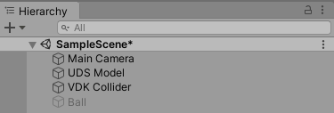
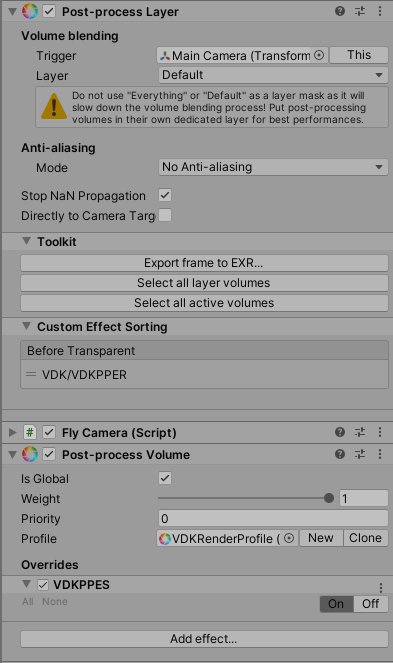
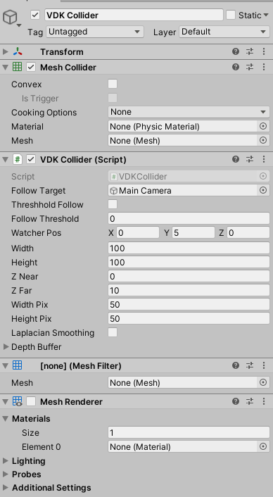
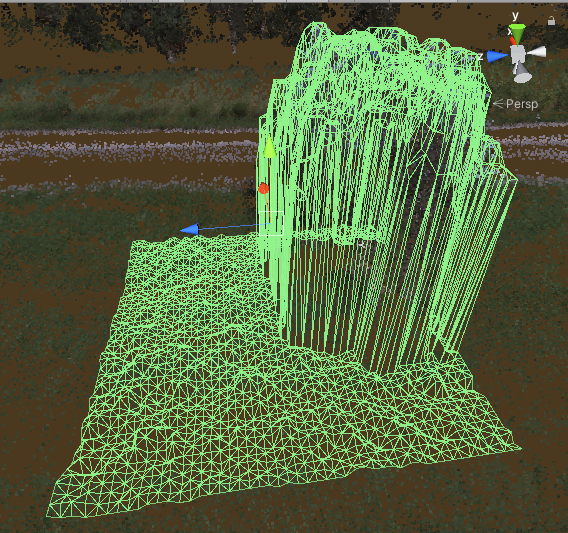
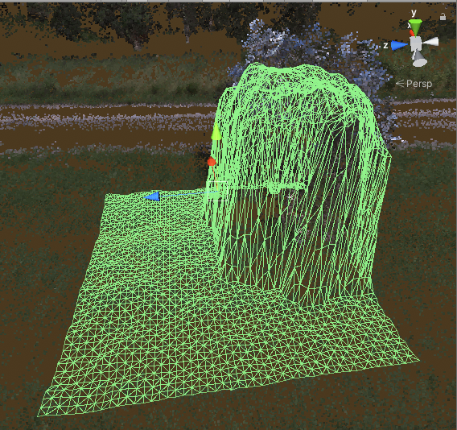

# VDK Unity

This project demonstrates the use of Euclideon Vault developer Kit (VDK) with the Unity game engine. 

<!-- TODO: Fill this section below with metadata about this sample-->
```
Language:              C#
Type:                  Integration
Contributor:           Euclideon Vault Development Team <support@euclideon.com>
Organization:          Euclideon, https://euclideon.com/vault
Date:                  2020-02-03
Vault SDK Version:     0.5.0
Toolsets:              Requires Unity >=2019.3
```

## Resources Required
Unity Postprocessing >=v2.3.0

## How to use the sample
<!-- TODO: Explain how this sample can be used and what is required to get it running -->
There are two projects included:

* The basic package, including a basic flight camera and collider, this demonstrates the basic concepts required to get simulations and games using VDK running in unity. This is ideal for developers wishing to use VDK with their own projects
* The advanced project: includes a driving simulator and third person ragdoll. This demonstrates use of VDK with Unity physics and is good for exploring and testing interactions of unity systems with Unlimited Detail point clouds.

**Both examples require a valid license for Euclideon Vault SDK, trial licenses can be obtained [here](https://zfrmz.com/gwVUru84d60yUedxmLx9/?ref=Unity%20Sample%20Code)** 

### Installation

Both examples are tested with Unity 2019.3.0f6, all steps must be repeated for each package in their respective directories.

1. Download and extract VDK 0.5.0 package from [here](https://earth.vault.euclideon.com) using your license credentials (if you do not have one, free trials are available from [here](https://zfrmz.com/gwVUru84d60yUedxmLx9/?ref=Unity%20Sample%20Code) )
2. Download the Unity VDK example from [here]()
3. Copy the files from Euclideon_vdk0.5.0/lib/(_your operating system here_)/to Assets/VDK in your Unity project
4. Replace the username and password lines from _Assets/VDK/vdkLogin.cs_ to your vault login details **YOUR UNITY EDITOR MAY CRASH ON LOAD IF THIS STEP IS NOT COMPLETED**
5. Open Unity Hub, Select Add and specify the downloaded project as the source folder
6. Open Window \-> package manager \-> Post Processing \-> update (ensure that postprocessing packages are installed and up to date, \>)


## Basic Example

This is an example demonstrating how to use VDK with unity, it includes a minimalist example of a flight camera and an attached collider. 
Unlimited detail rendering is implemented as a postprocessing effect that can be applied to cameras in order to display UDS objects.

### Sample Scene Structure


#### Main Camera

The main view used in the example. It has a flight camera script attached to it to enable user interation. Of importance to this object is 
the implemented post process layer and volume properties which must be included for the camera to view UDS files. 




### UDS Model

Each of UDS to be loaded in unity is represented as a one of these models.

### vdkLogin

This file contains the login logic for the unity example, including login credentials. GlobalVDKContext contains a [vdkContext]() for managing licensing 
and login information between objects, and a [vdkRenderContext](), enabling the rendering of and caching the UDS model information

### VDKPPER 

_VDKPPES.cs_ contains the implemention of VDK in Unity as a post processing effect.


### VDK Collider

This object demonstrates how to achieve physical collisions between Euclideon UDS models and native Unity colliders. Because of the potential scale of UDS objects it is not practical to construct mesh colliders of UDS objects (espeially if these objects are being streamed externally)
The approach taken is to construct a mesh of the UDS object local to a point of interest (for example a player or the potential colliding object using information available from an instance of [vdkRenderView](). 


Because the information contained in UDS files (especially unfiltered point clouds) can be noisy, we have included functionality to smooth the generated surfaces.

_VDKCollider.cs_ contains the majority of the logic associated with the example collider system.
 


_Because Unity does not allow collisions between a parent and child object, the collider cannot be a direct decendent of an object it is intended to collide with. 
Instead use the follow target parameter to keep the collider within an objects reference frame_

The VDK Colider Script takes the following parameters:

_Follow Target:_ If not none will set the transformation of the collider to match that of the target, useful for meshing locally around 
particular objects. 

_Threshold Follow:_ Determines the rate at which the location of the collider is updated, if true the location of the collider is updated only when the object is _Follow Threshold_ distance from the watcher position

_Watcher Pos:_ The location of the virtual camera in the local frame used to generate the collision mesh. Currently this should be set to 0.5*(ZNear-Zfar) in the direction the cameara is intended to look, this is to prevent unwanted clipping

_width, height:_ the dimensions of the polygon 'sheet' draped over the UDS model in metres, smaller colliders will have a higher polygon density and therefore better collision accuracy at lower computational cost

_Z Near, Z far:_ the locations of the near and far plane along the local z axis for the 'watcher' camera used to generate the collision polygon. 

_Width Pix, Height Pix:_ The number of pixels used to find the position of the vertices in the sheet. Currently this is equal to the number of vertices in the collision mesh. Smoother results may be obtained in future versions by oversampling around the vertex locations and averaging to eliminate noise.
These values have a large impact on frame rate and should be kept as low as possible. Increasing these improves the accuracy of the produced collision mesh.

_Laplacian Smoothing:_ This determines if smoothing should be applied to the collider, this has the effect of removing noise from laser scans at the cost of potentially removing 'sharp' features from the collision mesh.


Smoothing off (note the rougher ground surface due to sensor noise):
 

Smoothing on (note that tree branches are no longer captured by the collision model):


As the attached mesh is modified often by this script, baking options for the mesh collider should be turned off for performance reasons

## Known Issues

### Postprocessing bug on initial import
NullReferenceException: Object reference not set to an instance of an object
UnityEngine.Rendering.PostProcessing.AmbientOcclusion.IsEnabledAndSupported (UnityEngine.Rendering.PostProcessing.PostProcessRenderContext context) (at Library/PackageCache/com.unity.postprocessing@2.3.0/PostProcessing/Runtime/Effects/AmbientOcclusion.cs:182)
UnityEngine.Rendering.PostProcessing.PostProcessLayer.SetLegacyCameraFlags (UnityEngine.Rendering.PostProcessing.PostProcessRenderContext context) (at Library/PackageCache/com.unity.postprocessing@2.3.0/PostProcessing/Runtime/PostProcessLayer.cs:771)
UnityEngine.Rendering.PostProcessing.PostProcessLayer.SetupContext (UnityEngine.Rendering.PostProcessing.PostProcessRenderContext context) (at Library/PackageCache/com.unity.postprocessing@2.3.0/PostProcessing/Runtime/PostProcessLayer.cs:863)
UnityEngine.Rendering.PostProcessing.PostProcessLayer.BuildCommandBuffers () (at Library/PackageCache/com.unity.postprocessing@2.3.0/PostProcessing/Runtime/PostProcessLayer.cs:533)
UnityEngine.Rendering.PostProcessing.PostProcessLayer.OnPreCull () (at Library/PackageCache/com.unity.postprocessing@2.3.0/PostProcessing/Runtime/PostProcessLayer.cs:462)
UnityEngine.GUIUtility:ProcessEvent(Int32, IntPtr)

This occurs as a result of a bug in the postprocessing package, the solution is to remove the postprocessing layer from the
camera(s) and re add it with the same settings as provided. 

